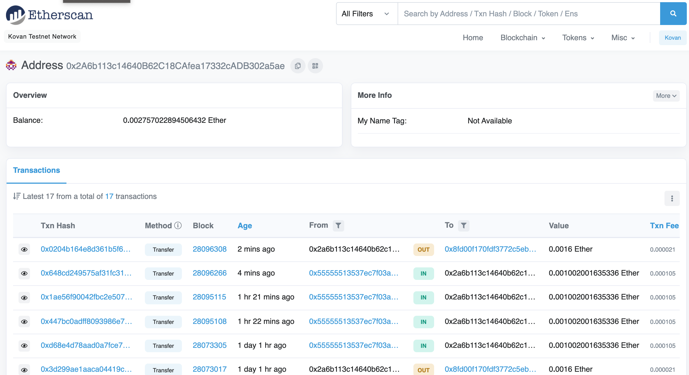
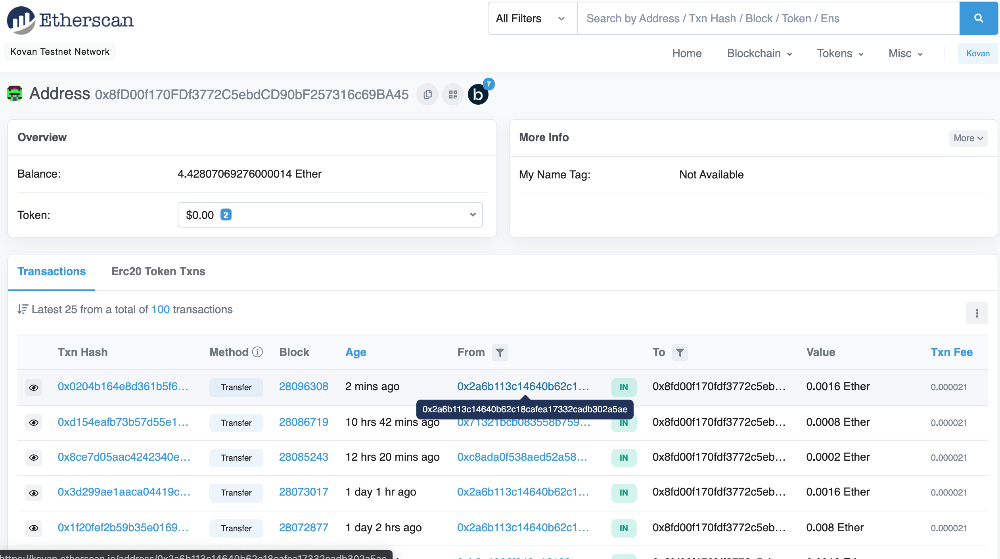
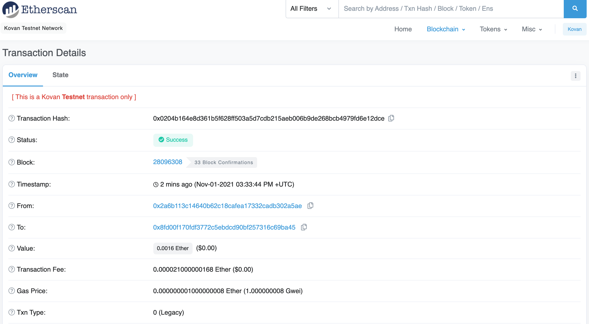

# Pay your tech talent in crypto
Fintech Finder-  an application that its customers can use to find fintech professionals from among a list of candidates, hire them, and pay them. The application leverages Ethereum blockchain network in order to enable your customers to instantly pay the fintech professionals whom they hire with cryptocurrency.

# Technology
## Technology
* Streamlit - a Python library that allows developers to quickly build web interfaces fro applications using Python script

* Web3.py - a Python library that enables connecting and performing operations on Ethereum based blockchains

* Mnemonic - A Python implementation for generating a 12- or 24-word mnemonic seed phrase based on the BIP-39 standard

* BIP44 - A Python implementation for deriving hierarchical deterministic wallets from a seed phrase based on the BIP-44 standard

To install the above library run the following command in your terminal:
``` python
pip install streamlit 
pip install web3==5.17
pip install mnemonic
pip install bip44
```

* Pandas - to showcase the transactions in a DataFrame
* Infura API - An API that provides instant access to the Ethereum network over HTTPS (i.e., the web). You will need to create an account with Infura https://infura.io/dashboard
---

## Required libraries and dependencies 

``` python
import os
import requests
from dotenv import load_dotenv
load_dotenv()
from bip44 import Wallet
from web3 import Account
from web3.auto.infura.kovan import w3
from web3 import middleware
from web3.gas_strategies.time_based import medium_gas_price_strategy

import streamlit as st
from dataclasses import dataclass
from typing import Any, List
```

## Usage 
To run the app, simply clone tihs github repository to your machine. Navigate to the directory that contains the 'fintech_finder.py' file and run the following command:

```python
streamlit run fintech_finder.py
```

Application interface


---

Etherscan - outcoming transaction



---

Etherscan - receiver's address incoming transaction



For a better overview of how the application works, please refer to the screencast included in this repo.

---

Etherscan -  transaction details



## Contributors
Brought to you by Ksenia Gorska
  kseniagorska@icloud.com 

[My linkedin profile](https://www.linkedin.com/in/ksenia-gorska/)

---

## License

MIT